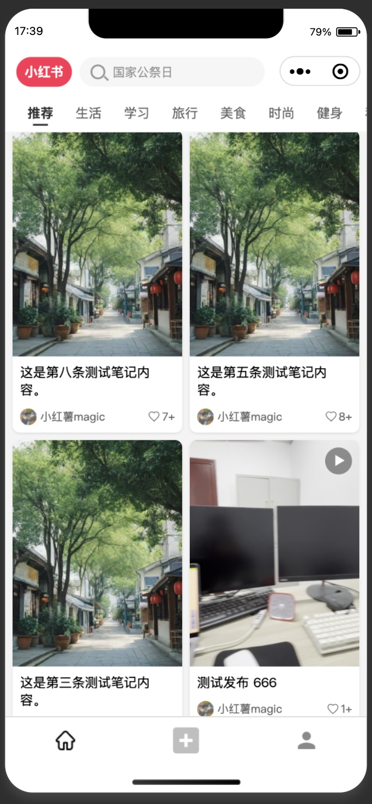

# 小红书风格微信小程序

一个模仿小红书风格的微信小程序，使用微信原生框架和 Bmob 后端云开发。

## 效果展示

### 首页



### 个人中心


### 发布页面


### 搜索页


### 签名设置


## 功能特性

### 用户系统
- 用户登录与注册
- 个人信息管理
  - 头像上传和更新
  - 昵称修改
  - 个性签名编辑
- 个人主页展示
  - 用户基本信息展示
  - 关注/粉丝/获赞数据统计
  - 个性签名展示

### 内容管理
- 笔记管理
  - 笔记列表展示
  - 笔记卡片式布局
  - 笔记标题和内容展示
  - 笔记作者信息展示
  - 笔记点赞数显示
- 收藏功能
  - 收藏列表展示
  - 收藏内容管理
- 点赞功能
  - 点赞列表展示
  - 点赞内容管理

### 界面特性
- 现代化 UI 设计
  - 渐变色背景
  - 圆角设计
  - 卡片式布局
- 标签页切换
  - 笔记/收藏/赞过的内容切换
  - 平滑切换动画
- 响应式布局
  - 适配不同屏幕尺寸
  - 网格布局展示
- 瀑布流布局
  - 首页内容瀑布流展示
  - 自适应内容高度

## 技术栈

- 微信小程序原生框架
- Bmob 后端云
  - 用户管理
  - 数据存储
  - 文件存储
- CSS3
  - Flexbox 布局
  - Grid 布局
  - 渐变色背景
  - 动画效果

## 数据模型

### 用户表 (_User)
- objectId: 用户ID
- nickname: 昵称
- avatar: 头像
- signature: 个性签名
- followCount: 关注数
- fansCount: 粉丝数
- likeCollectCount: 获赞与收藏数

### 笔记表 (note)
- objectId: 笔记ID
- content: 笔记内容
- images: 图片数组
- author: 作者（关联用户表）
- likeCount: 点赞数
- createdAt: 创建时间

### 收藏表 (favorite)
- objectId: 收藏ID
- user: 用户（关联用户表）
- note: 笔记（关联笔记表）
- createdAt: 收藏时间

### 点赞表 (like)
- objectId: 点赞ID
- user: 用户（关联用户表）
- note: 笔记（关联笔记表）
- createdAt: 点赞时间

### 分类表 (category)
- objectId: 分类ID
- name: 分类名称
- sort: 排序值
- createdAt: 创建时间

## 目录结构

```
├── pages/
│   ├── index/             # 首页
│   ├── profile/           # 个人主页
│   ├── settings/          # 设置页面
│   ├── login/             # 登录页面
│   ├── publish/           # 发布页面
│   ├── search/            # 搜索页面
│   └── detail/            # 笔记详情页
├── components/
│   ├── note-card/         # 笔记卡片组件
│   ├── tab-bar/           # 底部标签栏组件
│   └── loading/           # 加载组件
├── utils/                 # 工具函数
├── styles/                # 全局样式
├── assets/                # 静态资源
├── app.js                 # 应用入口
├── app.json               # 应用配置
└── app.wxss               # 应用样式
```

## 已实现功能

- [x] 首页瀑布流布局
- [x] 分类导航固定顶部
- [x] 个人中心页面
- [x] 笔记卡片组件
- [x] 搜索页面
- [x] 发布页面基础布局
- [x] 签名设置功能
- [x] 下拉刷新和上拉加载更多

## 待实现功能

- [ ] 评论功能
- [ ] 关注/取关功能
- [ ] 消息通知
- [ ] 图片上传优化
- [ ] 数据缓存优化
- [ ] 视频播放功能
- [ ] 地理位置功能
- [ ] 分享功能

## 开发环境

- 微信开发者工具
- Node.js
- Bmob 后端云服务

## 如何运行

1. 克隆项目到本地
2. 在微信开发者工具中导入项目
3. 配置 Bmob 后端云
   - 在 `app.js` 中配置 Bmob 的 Application ID 和 REST API Key
4. 编译运行项目

## 注意事项

- 需要在微信开发者工具中开启 ES6 转 ES5 功能
- 需要配置合法域名以支持 Bmob API 调用
- 建议使用最新版本的微信开发者工具 

# 小红书小程序开发日志

## 2024-03-10 功能更新记录

### 首页优化
1. 实现分类导航固定顶部功能
   - 将分类导航从滚动区域中移出
   - 使用固定定位保持在顶部
   - 调整滚动区域的顶部边距
2. 优化瀑布流布局，实现左右两列内容
3. 添加下拉刷新和上拉加载更多功能
4. 优化数据加载逻辑，减少重复请求

### 个人中心页面优化
1. 实现标签页切换功能
   - 笔记/收藏/赞过内容切换
   - 添加滑动切换效果
2. 优化用户信息展示
   - 添加关注/粉丝/获赞数据统计
   - 优化个性签名展示
3. 实现笔记列表瀑布流布局

### 发布功能
1. 创建发布页面基础布局
2. 实现图片选择和预览功能
3. 添加文本输入区域
4. 实现分类选择功能

### 搜索功能
1. 创建搜索页面
2. 实现搜索历史记录
3. 添加热门搜索推荐
4. 优化搜索结果展示

## 2024-02-24 样式优化记录

### 笔记卡片组件（note-card）
1. 创建全局笔记卡片组件，支持图片和视频两种类型
2. 视频类型右上角添加视频播放图标
3. 使用渐变色背景替代图片，减少加载时间
4. 统一的卡片样式，包括圆角、阴影等
5. 使用 SVG 图标实现点赞按钮

### 个人主页样式优化（profile）
1. 顶部背景使用渐变色：`linear-gradient(180deg, #2C3E50, #3498DB)`
2. 内容区域采用双列网格布局：
   ```css
   .grid-container {
     display: grid;
     grid-template-columns: repeat(2, 1fr);
     gap: 20rpx;
     padding: 20rpx;
   }
   ```
3. 笔记卡片使用四种不同渐变色背景循环显示：
   ```css
   .note-card:nth-child(4n+1) .note-image {
     background: linear-gradient(45deg, #FF9A9E, #FAD0C4);
   }
   .note-card:nth-child(4n+2) .note-image {
     background: linear-gradient(45deg, #A18CD1, #FBC2EB);
   }
   .note-card:nth-child(4n+3) .note-image {
     background: linear-gradient(45deg, #84FAB0, #8FD3F4);
   }
   .note-card:nth-child(4n+4) .note-image {
     background: linear-gradient(45deg, #FFD1FF, #FAD0C4);
   }
   ```
4. 内容区域背景色统一为 `#f8f8f8`，并铺满整个视口
5. 标签页切换添加红色下划线动画
6. 设置按钮使用半透明白色背景

### 数据加载优化
1. 在 `onShow` 生命周期中刷新数据
2. 使用 `include` 一次性获取关联数据
3. 添加错误处理和日志记录
4. 统一笔记类型的处理（image/video） 